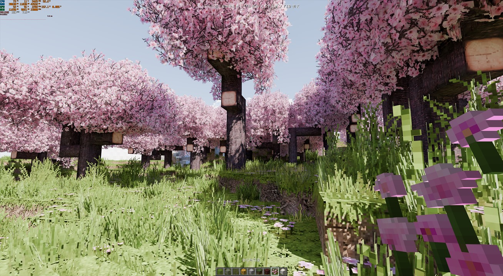
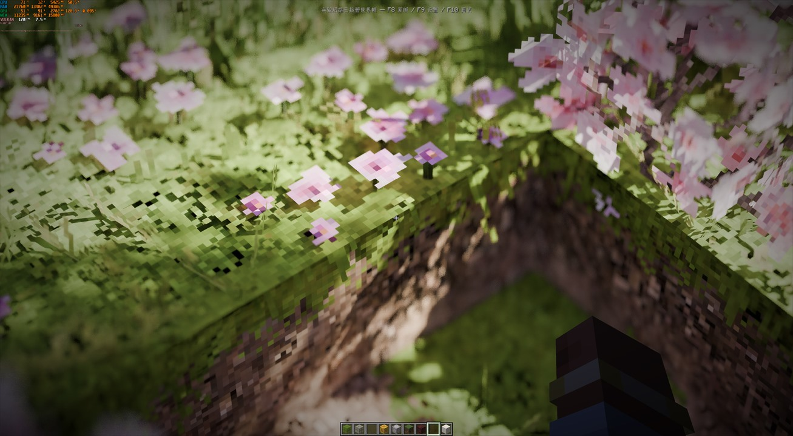
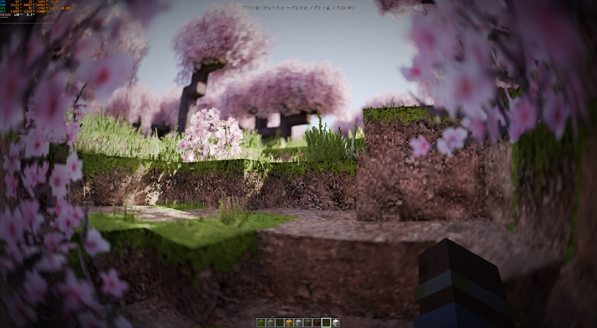
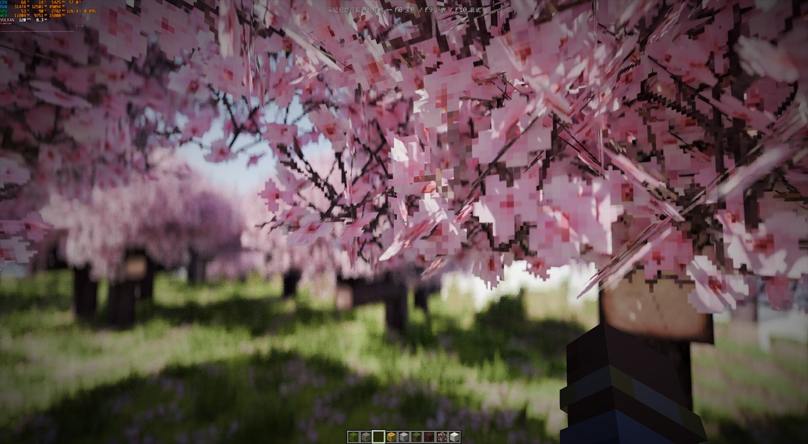
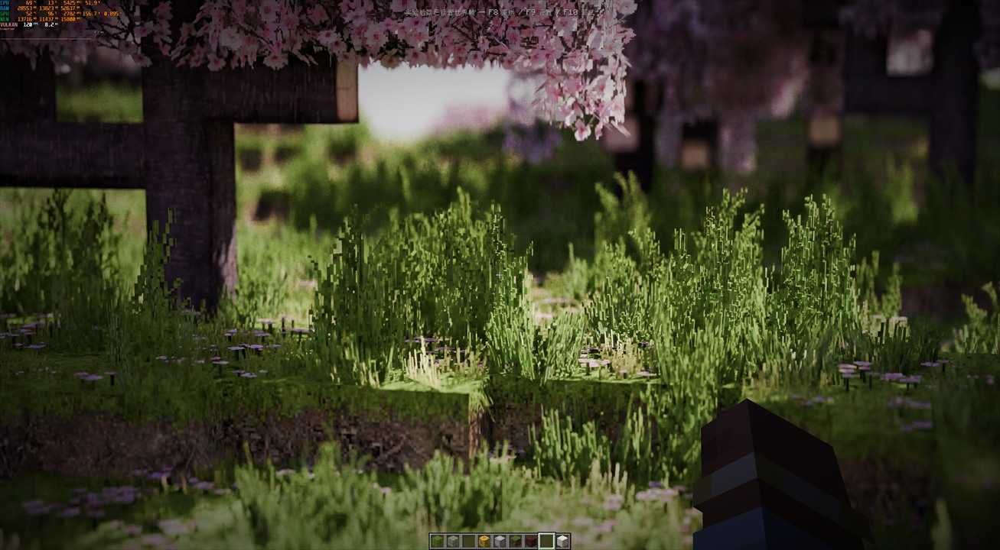

# Cycles Renderer for Minecraft

[](LICENSE)
[](https://www.minecraft.net/)
[](https://neoforged.net/)

Cycles Renderer 是一个面向 Minecraft 26.2 / NeoForge 26.2 的实验性客户端 MOD。它把 Minecraft 世界转换为可增量更新的场景，交给 Blender Cycles 5.2 路径追踪，并通过 Vulkan 将结果重新显示到游戏窗口中。

项目的目标不是制作传统 GLSL 光影包，而是让 Cycles 成为 Minecraft 可实时调用的“光影级”渲染器：保留 Minecraft 的世界、输入、界面与模组生态，同时使用 OptiX/CUDA、物理材质、降噪和现代 HDR 管线生成世界画面。离线相机渲染属于未来方向，当前开发重心是实时游玩。

> [!WARNING]
> 本项目仍处于原型开发阶段，尚不适合作为普通整合包中的即装即用 MOD。当前主要开发平台是 Windows x64 与 NVIDIA RTX；接口、画面和性能仍可能快速变化。

## 画面展示

以下画面来自实验客户端中的 Blender Cycles 5.2 实时路径追踪输出。截图保留了性能与调试叠加层；请注意，叠加层显示的 Vulkan 帧率代表 Minecraft Vulkan 后端的帧率，与 Cycles 的实际输出帧率无关，当前 Cycles 实际输出约为 10–20 FPS。以下演示使用 Patrix 32x 资源包。



| 景深与近距离材质细节 | 低机位樱花林画面 |
| --- | --- |
|  |  |

| 花瓣近景与焦外 | 林下光照与焦外过渡 |
| --- | --- |
|  |  |

## Ultra Vibe Coded：许愿机编程宣言

嘻嘻。欢迎来到全新黄金时代——许愿机编程！只要还有梦，一切皆有可能实现。

这是一个 **100% AI 编写、Ultra Vibe Coded** 的实验项目。本仓库原创实现的唯一代码贡献者是 **ChatGPT**；仓库拥有者负责许愿、测试、截图，以及判断它到底有没有跑起来。

震撼屎山现已发布。想卡出翔，那就快来试试吧：即使使用 RTX 5090，也未必能够稳定达到 1080p 30 FPS。项目仅供研究和娱乐，不提供性能、稳定性、兼容性或数据安全保证。

> [!CAUTION]
> 使用前请备份游戏客户端、存档、配置和资源包。请勿直接在唯一存档或重要客户端环境中测试开发构建。

<sub>神秘小字：注——仓库拥有者本人对编程一窍不通。</sub>

## 核心特性

### Blender Cycles 实时渲染

- 使用固定版本的 Blender Cycles 5.2 渲染 Minecraft 世界。
- 优先选择 OptiX，随后可回退到 CUDA 或 CPU。
- Cycles 在独立会话线程中渐进渲染；世界更新时继续显示上一张有效帧。
- 移动时使用低采样交互帧，静止后自动进入更高采样和降噪阶段。

### Minecraft 场景桥

- 直接捕获 Minecraft `SectionCompiler` 已生成的 16³ Section 网格，而不是重新解析方块模型 JSON。
- 支持原版方块、流体，以及通过标准 NeoForge Section 几何入口加入的内容。
- 方块放置、破坏、光照更新、区块装卸和视距移动会增量同步到 Native 场景。
- Section 使用稳定 ID、驻留槽和预留容量；普通更新优先进行动态 BVH refit，容量不足时才重建拓扑。

### Vulkan 与 FP16 显示链路

- Minecraft 继续拥有窗口、Vulkan 设备、交换链和最终命令提交。
- Cycles 输出保持 scene-linear RGBA16F，避免在中间链路提前压缩到 8-bit。
- 支持三槽 Vulkan external buffer 与 timeline semaphore 互操作，OptiX/CUDA 可直接写入共享显存。
- 互操作不可用或发生错误时，可安全回退到 FFM/CPU 帧上传路径。
- 主渲染目标支持 FP16 管线，并提供 SDR 回退与实验性的 scRGB/HDR 输出路径。

### 降噪与 DLSS

- 支持 OptiX Denoiser 与 OpenImageDenoise。
- 交互阶段保持 Raw，静止 Combined 帧才调度降噪，减少移动时的延迟。
- 提供实验性的 NVIDIA DLSS Ray Reconstruction 构建。
- 降噪选择、实际生效后端、调度原因和 Raw/Denoised 状态均可诊断。

### LabPBR 1.3 材质

- 从 Minecraft 实际方块图集中发现并构建 LabPBR 伴随纹理。
- 支持法线、粗糙度、介电 F0、金属、自发光、AO、孔隙度/湿润度和 SSS 数据。
- 支持 Bump 与图集安全的 Parallax Occlusion Mapping。
- 支持预定义金属响应、透明裁剪，以及实验性的玻璃与水传输材质。
- 资源包重载会同步重建基础色、法线、材质和辅助图集。

### 相机、色彩与画面控制

- 支持 Minecraft FOV 与物理镜头两套投影方式。
- 提供焦距、传感器宽度、景深、光圈、对焦距离、相机 Shift 和安全框。
- 支持自动曝光、自动对焦及多种 Cycles 全景相机模式。
- 提供 EV、Gamma、白平衡、工作色彩空间和显示变换控制。
- 内置程序大气，可调整太阳位置、大小、强度以及空气、气溶胶和臭氧密度。

### Pass 查看与性能诊断

- 可查看 Combined、Depth、Normal、Diffuse Color、Emission、Roughness 和 Sample Count。
- Native 端按需维护 Raw/Denoised Pass 缓存，不会无条件复制全部 Pass。
- F10 叠加层显示设备、分辨率、采样、Section、interop、降噪、材质和相机状态。
- 卡顿检测器可关联 Minecraft CPU、Vulkan GPU、Section 更新、Cycles device/geometry/BVH 和首帧时序，并输出 JSONL 日志。

## 当前支持情况

| 功能 | 状态 |
| --- | --- |
| 静态方块与流体 | 可用 |
| 方块放置/破坏与区块装卸 | 可用，仍在持续优化卡顿 |
| OptiX / CUDA / CPU | 可用，OptiX 为主要目标 |
| Vulkan 外部显存互操作 | 可用，保留 CPU 回退 |
| OptiX / OIDN 降噪 | 可用 |
| DLSS Ray Reconstruction | 实验性 |
| LabPBR 1.3 | 已接入主要通道，部分高级能力仍在开发 |
| FP16 / SDR / scRGB HDR | FP16 与 SDR 已接入，HDR 仍需更多设备验证 |
| 实体、方块实体和物品 | 尚未完整支持 |
| Distant Horizons | 近期不支持 |
| 离线相机渲染 | 未来规划 |

## 游戏内操作

| 按键 | 功能 |
| --- | --- |
| `F8` | 启用或关闭 Cycles 世界渲染；关闭后恢复原版世界画面 |
| `F9` | 打开 Cycles 设置页面 |
| `F10` | 切换实时诊断叠加层 |

设置保存在 `config/cyclesrenderer-client.toml`。设备、分辨率、采样、反弹次数、降噪、相机、大气、色彩和 LabPBR 参数均可在游戏内调整；部分启动级 Vulkan/DLSS 能力修改后需要重启客户端。

## 已知限制

- 当前只重点开发和验证 Windows x64；NVIDIA RTX 是主要目标硬件。
- Cycles 只接管世界画面，不负责 Minecraft 游戏逻辑、GUI 或交换链。
- 实体、方块实体、手持物品和使用自定义渲染器的 MOD 内容可能缺失。
- Distant Horizons、真实位移/细分和完整运行时 PBR 动画尚未实现。
- 全景相机、HDR、景深和 DLSS 属于实验功能，可能存在驱动或场景相关问题。
- 区块首次进入视距或 Section 容量溢出时仍可能触发昂贵的几何/BVH 更新。
- Native DLL、Java FFM 布局与 Cycles 补丁必须来自同一构建，不能混用不同版本产物。

## 从源码运行

### 环境要求

- Windows 10/11 x64
- Minecraft `26.2`
- NeoForge `26.2.0.58`
- Gradle `9.2.1`
- JDK 17 Gradle 启动环境，以及 Java 25 toolchain
- Visual Studio 2022 C++ x64 工具链
- CMake 3.25 或更高版本
- NVIDIA 驱动；构建 GPU 后端时还需要 CUDA 13.3 与 OptiX 9.1

依赖、Cycles 源码和构建产物会放在 `.deps/`、`.tools/` 与 `build/`，这些目录不应提交到 Git。

### 标准构建

```powershell
git clone https://github.com/Cocklebur-flowery/cycles-mod.git
cd cycles-mod

powershell -ExecutionPolicy Bypass -File .\scripts\setup-cycles.ps1
.\gradlew.bat verifyProject
.\gradlew.bat runClient
```

也可以使用仓库内的 Windows 启动脚本：

```bat
run-client.cmd setup
run-client.cmd verifyProject
run-client.cmd runClient
```

### 实验性 DLSS 构建

DLSS 构建使用独立的 `cycles-dlss` 与 `native-dlss` 目录，不会覆盖标准构建：

```powershell
powershell -ExecutionPolicy Bypass -File .\scripts\setup-cycles.ps1 -ExperimentalDlss
.\gradlew.bat verifyProject -PexperimentalDlss=true
.\gradlew.bat runClient -PexperimentalDlss=true
```

`verifyProject` 是完整自动验证的单一入口：先执行 Java `build`，再构建所选 native
变体并运行 CTest 注册的全部测试。`runNativeTests` 和 `runNativeSmoke` 仍保留为聚焦
诊断入口，不替代完整验证。

首次依赖准备耗时较长。后续 `buildNative` 会复用已经校验的固定版本依赖，不会重新下载完整仓库。

## 运行时结构

```text
Minecraft SectionCompiler
  -> Section 网格捕获与资源包图集
  -> Java 场景缓存和增量提交
  -> Java FFM / 稳定 C ABI
  -> Cycles Scene + 固定 Section Mesh 槽
  -> OptiX / CUDA / CPU 渐进渲染
  -> RGBA16F DisplayDriver
  -> Vulkan external buffer 或 CPU 帧回退
  -> Minecraft FP16 主目标与显示变换
  -> SDR / scRGB 输出和 Minecraft GUI
```

## 文档与开发

详细设计、稳定契约和阶段验收记录位于 [`docs/`](docs/)：

- [`docs/commit-conventions.md`](docs/commit-conventions.md)：提交标题、正文、ABI/生命周期契约和验证矩阵规范。
- [`docs/issue-conventions.md`](docs/issue-conventions.md)：Issue 生命周期、Severity、失败尝试账本和 Issue/Commit/PR/Test 关系规范。
- [`docs/render-bridge-and-settings-plan.md`](docs/render-bridge-and-settings-plan.md)：场景桥与设置系统总览。
- [`docs/stages/performance-tracing.md`](docs/stages/performance-tracing.md)：CPU/GPU 卡顿追踪与 JSON 字段。
- [`docs/stages/hdr-and-vulkan-interop.md`](docs/stages/hdr-and-vulkan-interop.md)：FP16、HDR 与 CUDA/Vulkan 互操作。
- [`docs/stages/labpbr-materials.md`](docs/stages/labpbr-materials.md)：LabPBR 材质桥。
- [`docs/stages/denoising.md`](docs/stages/denoising.md)：交互/静止降噪调度。
- [`docs/stages/camera-panorama.md`](docs/stages/camera-panorama.md)：物理镜头和全景相机。

提交问题时，请附上 Minecraft 日志、F10 截图、GPU/驱动信息，以及 `run/logs/cyclesrenderer-performance-*.jsonl` 中与卡顿对应的捕获窗口。不要上传整个 `.deps/` 或 `build/` 目录。

## 致谢与贡献者

唯一代码贡献者：**ChatGPT（OpenAI）**。

特别感谢：

- **Blender Foundation 与 Cycles 项目**：提供本项目的路径追踪核心。
- **NVIDIA DLSS Ray Reconstruction**：提供实验性神经渲染与光线重建能力。
- **OpenAI**：提供 ChatGPT/Codex，让“许愿机编程”成为现实。

以上名称仅用于说明依赖来源与表达感谢，不表示 Blender Foundation、NVIDIA 或 OpenAI 对本项目提供官方支持、认证或背书。仓库拥有者、ChatGPT 与各第三方项目之间不存在因此产生的隶属关系。

## 许可证

本仓库原创代码以 [MIT License](LICENSE) 发布。Blender Cycles、Minecraft、NeoForge、NVIDIA DLSS、OpenImageDenoise 及其他第三方组件仍分别受其自身许可证和分发条款约束；MIT 许可证不会改变这些第三方条款。
